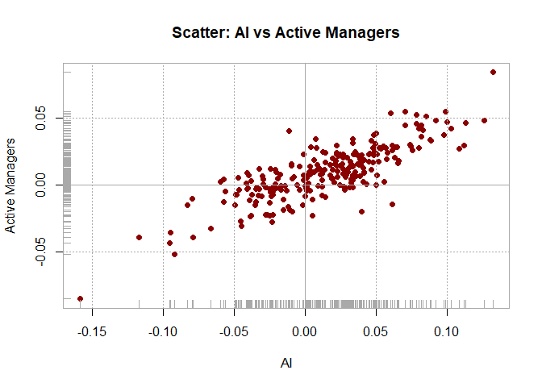
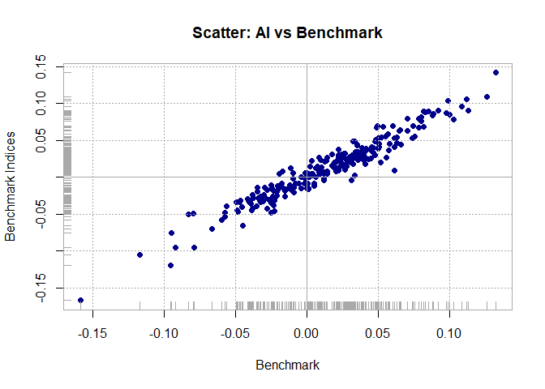
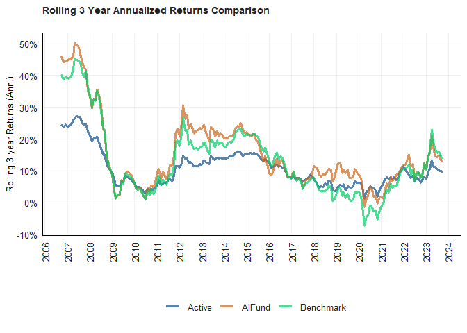
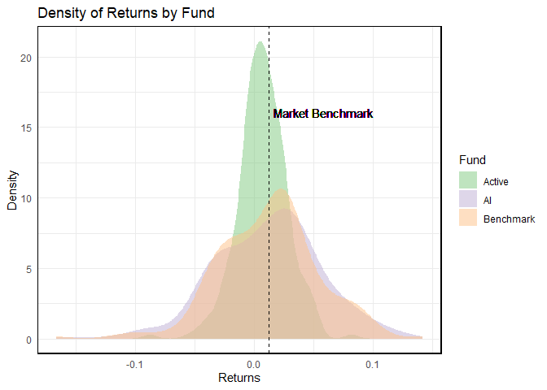
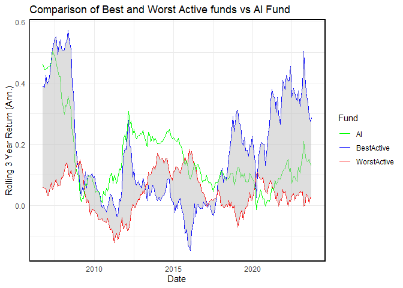
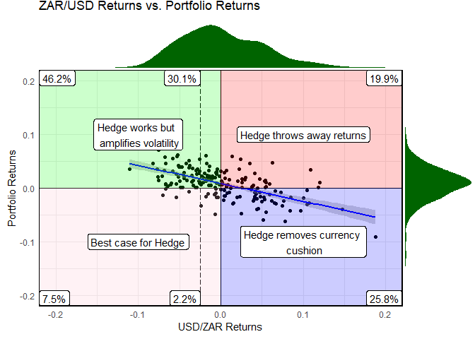
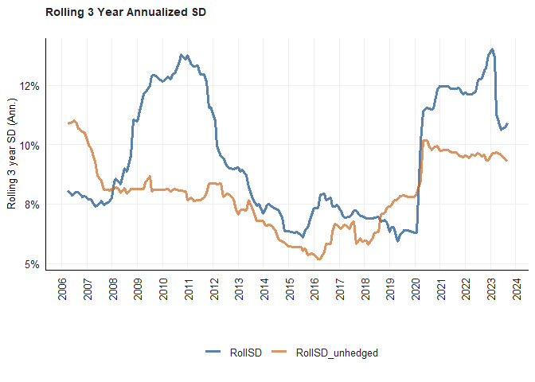

# Purpose

Purpose of this work folder.

Ideally store a minimum working example data set in data folder.

Add binary files in bin, and closed R functions in code. Human Readable
settings files (e.g. csv) should be placed in settings/

## Question 1

This question investigates returns from an AI Fund, a market benchmark
(CAPPED SWIX) and active managers. It aims to shed light on the
differences and similarity in return structures through various
visualisation techniques.

In terms of data preparation, I calculate the average returns for both
ASISA and the benchmark across all funds and tickers. I then join these
returns with the returns of the AI fund into one data frame. I then
convert this into an ‘xts’ object which allows me to use the
‘PerformanceAnalytics’ package.

``` r
#Load and prep the data
ASISA <- read_rds("data/ASISA_Rets.rds")
BM <- read_rds("data/Capped_SWIX.rds")
AI_Fund <- read_rds("data/AI_Max_Fund.rds")

#Calculate the average ASISA return across all funds for a given month
ASISA_average <- ASISA %>% 
    group_by(date) %>% 
    summarise(meanReturn = mean(Returns))

#Calculate the average BM return across all indices for a given month
BM_average <- BM %>% 
    group_by(date) %>% 
    summarise(meanReturn = mean(Returns))


#Get all the returns in the same dataframe
returnDF <- left_join(ASISA_average, BM_average, by = 'date') %>% 
    left_join(AI_Fund, by='date')
colnames(returnDF)<- c('date','Active', 'Benchmark', 'AI')

returnDF <- returnDF %>% 
    pivot_longer(cols = c(-date),
                 names_to = "Fund",
                 values_to = "Returns")

#Convert to XTS
xts.returnDF <- returnDF %>% 
    tbl_xts(tblData = ., cols_to_xts = Returns, spread_by = Fund)
```

``` r
AIvsActive <- chart.Scatter(x = xts.returnDF$AI, 
                            y = xts.returnDF$Active, 
                            main = "Scatter: AI vs Active Managers", col = "darkred",symbolset = 16, 
                            xlab = "AI", ylab = "Active Managers")
```



The figure above, made by the ‘PerformanceAnalytics’ package, shows a
scatter between the returns of active managers and the AI fund. A clear
positive correlation is visible.

``` r
AIvsBenchmark <- chart.Scatter(x = xts.returnDF$AI, 
                            y = xts.returnDF$Benchmark, 
                            main = "Scatter: AI vs Benchmark", col = "darkblue",symbolset = 16, 
                            xlab = "Benchmark", ylab = "Benchmark Indices")
```



The figure above now shows a scatter between the returns of the
benchmark and the AI fund. An even stronger positive correlation is now
visible. This means that for, in both cases, it is rare for the AI fund
to show a negative return when the other funds show a positive return
and vice-versa.

The next step is to calculate rolling returns for all 3 funds. I
calculate the annualised rolling 3 year return using the ‘roll_prod’
function in the ‘RcppRoll’ package. I then join these rolling returns
together and then convert this data frame into long format to get it
ready for plotting.

``` r
##ASISA
#Calculate the annualized three year rolling return
ASISA_RollRet <- ASISA_average %>% 
    mutate(RollRets_ASISA = RcppRoll::roll_prod(1 + meanReturn, 36, fill = NA, align = "right")^(12/36)-1) %>% 
    group_by(date) %>% 
    filter(any(!is.na(RollRets_ASISA))) %>% 
    ungroup() %>%
    select(date, RollRets_ASISA)
    
##BM
##Calculate the annualized three year rolling return
BM_RollRet <- BM_average %>% 
    mutate(RollRets_BM = RcppRoll::roll_prod(1 + meanReturn, 36, fill = NA, align = "right")^(12/36)-1) %>% 
    group_by(date) %>% 
    filter(any(!is.na(RollRets_BM))) %>% 
    ungroup() %>%
    select(date, RollRets_BM)

joinedDF <- left_join(ASISA_RollRet, BM_RollRet, by = "date")

##AIFund
#Calculate the annualized three year rolling return
AI_RollRet <- AI_Fund %>% 
    mutate(RollRets_AI = RcppRoll::roll_prod(1 + AI_Fund, 36, fill = NA, align = "right")^(12/36)-1) %>% 
    group_by(date) %>% 
    filter(any(!is.na(RollRets_AI))) %>% 
    ungroup() %>%
    select(date, RollRets_AI)

joinedDF <- joinedDF %>% 
    left_join(AI_RollRet, by = "date")
colnames(joinedDF) <- c('date','Active','Benchmark','AIFund')


#Creating plotting dataframe
plottingDF <- joinedDF %>% 
    pivot_longer(cols = c(-date),
                 names_to = "Fund",
                 values_to = "RollingReturns")
```

``` r
g <- plottingDF %>% 
    ggplot() + 
    geom_line(aes(date, RollingReturns, color = Fund), alpha = 0.7, size = 1.25) + 
    labs(title = "Rolling 3 Year Annualized Returns Comparison", 
        subtitle = "", x = "", y = "Rolling 3 year Returns (Ann.)", 
        caption = "") + 
    theme_fmx(title.size = ggpts(30), subtitle.size = ggpts(5), caption.size = ggpts(25), CustomCaption = F) + 
    fmx_cols()+
    scale_fill_brewer(palette = "Accent") 
    

finplot(g, x.date.dist = "1 year", x.date.type = "%Y", x.vert = T, 
    y.pct = T, y.pct_acc = 1)
```



The rolling 3 year annualised returns of all three funds are shown
above. All three funds tend to follow each other and show significant
downturns during the GFC and Covid-19. Comparatively, the active
managers perform the worst, as for large periods of time there rolling
returns are substantially lower than the other two funds. The AI fund
seems capable of outperforming the benchmark, but never for long periods
of time.

Next, I pivot the returns dataframe wider in order to apply a 25bps fee
on both the active managers and the AI fund. I then take the dataframe
back to long format in order to once again get it ready for plotting.

``` r
returnDF <- returnDF %>% 
    pivot_wider(names_from = Fund, values_from = Returns)
returnDF <- returnDF %>% 
    mutate(Active = Active - 0.025/12) %>%   # Applying a 25bps fee for active and AI fund
    mutate(AI = AI - 0.025/12)
returnDF <- returnDF %>% 
    pivot_longer(cols = c(-date),
                 names_to = "Fund",
                 values_to = "Returns")
```

``` r
# Plot the density functions of each return and add a line for the mean benchmark return
mean_benchmark_returns <- mean(returnDF$Returns[returnDF$Fund == "Benchmark"])

densityPlot <- ggplot(returnDF, aes(x = Returns)) + 
    geom_density(aes(fill = Fund), alpha = 0.5, color = NA) +
    geom_vline(xintercept = mean_benchmark_returns, linetype = "dashed", color = "black") +
    geom_text(aes(x = mean_benchmark_returns, y = 15), label = "Market Benchmark", 
              vjust = -1, hjust = -0.05, color = "black") +
    labs(title = "Density of Returns by Fund",
         x = "Returns",
         y = "Density") +
    theme_minimal() +
    scale_fill_brewer(palette = "Accent") +
    theme(panel.border = element_rect(colour = "black", fill=NA, size=1))
densityPlot
```

 The
density functions of returns, grouped by fund, show a clear result.
Active managers tend to perform below the market benchmark. The marker
benchmark here was defined as the average return of the benchmark, as
can be seen in the code above. The market benchmark and the AI fund
perform very similar. The key difference here lies in the flatter
distribution of the AI fund, meaning it is less consistent that the
market benchmark.

The next chunk of code aims to compare the AI fund with the best and
worst performing actively managed fund. This is done by first filtering
the raw data to contain only funds with complete data, as some funds
only started recently or closed down, which makes comparison difficult.
Next the best active fund is selected by calculating the average return
for all funds and selecting the best one. The worst fund is found the
exact same way. I then calculate the rolling returns for these two
funds, using ‘RcppRoll’ and then join them in a data frame with the
rolling returns for the AI fund

``` r
#Filter out funds that don't have complete date
years <- 2003:2023
funds_with_complete_data <- ASISA %>%
  mutate(Year = year(as.Date(date))) %>%   
  group_by(Fund) %>%
  summarize(All_Years_Present = all(years %in% unique(Year))) %>% 
  filter(All_Years_Present) %>%
  pull(Fund)

#Find best performing fund
BestActive <- ASISA %>%
  filter(Fund %in% funds_with_complete_data) %>%
  group_by(Fund) %>%
  summarise(Average_Return = mean(Returns, na.rm = TRUE)) %>%
  arrange(desc(Average_Return)) %>%
  slice(1)

BestActiveReturns <- ASISA %>% 
    filter(Fund == BestActive$Fund) %>% 
    select(c('date','Returns'))


##Find worse performing fund
WorstActive <- ASISA %>%
  filter(Fund %in% funds_with_complete_data) %>%
  group_by(Fund) %>%
  summarise(Average_Return = mean(Returns, na.rm = TRUE)) %>%
  arrange(Average_Return) %>%
  slice(1)

WorstActiveReturns <- ASISA %>% 
    filter(Fund == WorstActive$Fund) %>% 
    select(c('date','Returns'))

#Get the rolling returns for best and worst fund
Best_RollRet <- BestActiveReturns %>% 
    mutate(RollRets_best = RcppRoll::roll_prod(1 + Returns, 36, fill = NA, align = "right")^(12/36)-1) %>% 
    group_by(date) %>% 
    filter(any(!is.na(RollRets_best))) %>% 
    ungroup() %>%
    select(date, RollRets_best)

Worst_RollRet <- WorstActiveReturns %>% 
    mutate(RollRets_worst = RcppRoll::roll_prod(1 + Returns, 36, fill = NA, align = "right")^(12/36)-1) %>% 
    group_by(date) %>% 
    filter(any(!is.na(RollRets_worst))) %>% 
    ungroup() %>%
    select(date, RollRets_worst)

##Group these funds and AI into one dataset
BestAndWorseDF <- left_join(Best_RollRet, Worst_RollRet, by = 'date') %>% 
    left_join(AI_RollRet, by = 'date')
colnames(BestAndWorseDF) <- c('date', 'BestActive', 'WorstActive', 'AI')
```

Next I plot these funds and shade the area between the best and worse
fund.

``` r
plotDiff <- ggplot(BestAndWorseDF, aes(x = date)) +
  geom_line(aes(y = BestActive, colour = "BestActive")) +
  geom_line(aes(y = WorstActive, colour = "WorstActive")) +
  geom_line(aes(y = AI, colour = "AI")) +
  geom_ribbon(aes(ymin = WorstActive, ymax = BestActive), fill = "grey", alpha = 0.5) +
  labs(title = "Comparison of Best and Worst Active funds vs AI Fund",
       x = "Date",
       y = "Rolling 3 Year Return (Ann.)",
       colour = "Fund") +
  scale_colour_manual(values = c("BestActive" = "blue", "WorstActive" = "red", "AI" = "green")) +
  theme_minimal()+
  theme(panel.border = element_rect(colour = "black", fill=NA, size=1))
plotDiff
```



The figure reveals an interesting story. It appears that the AI fund
often lies between the rolling returns of these two funds.
Interestingly, for a period in the middle of our sample, the worst
performing fund, actually outperformed the best performing fund. This
potentially speaks to the shortcomings of average returns as a metric of
success. In this period, the AI fund also outperformed both of these
fund. The AI fund performs lower than the worst fund at times, but this
usually does not last long.

# Question 2

This question focuses on a recent article that discusses the
misconception surrounding hedging out the Rand. By replicating the
figure within that article I therefore show that hedging vary rarely has
beneficial effects. I then go further by showing how the volatility of a
portfolio can actually be increased through hedging

For data preparation I load in the data and then apply the weights
specified in the question to the corresponding asset by multiplying it
return with the corresponding weight. Summing these returns then yield
the total portfolio returns. I then calculate the ZAR returns and lastly
join the two return series’ into one data frame.

``` r
Indexes <- read_rds("data/Cncy_Hedge_Assets.rds")
ZAR <- read_rds("data/Monthly_zar.rds")

#Apply weights
Portfolio <- Indexes %>% 
    mutate(MSCI_ACWI = MSCI_ACWI * 0.18) %>% 
    mutate(Bbg_Agg = Bbg_Agg * 0.12) %>% 
    mutate(J433 = J433 * 0.42) %>% 
    mutate(ALBI = ALBI * 0.28)

#Calculate portfolio return.
PortfolioReturns <- Portfolio %>%
    rowwise() %>%
    mutate(sum = sum(c_across(-date), na.rm = TRUE)) %>%
    select(date, sum)

#Calculate ZAR returns
ZAR_Returns <- ZAR %>% 
    mutate(Return = value/lag(value) - 1) %>% 
    select(c('date','Return'))

#Join in one dataframe
joinedDF <- left_join(PortfolioReturns, ZAR_Returns, by = 'date')
colnames(joinedDF)<- c('date','Portfolio_Returns','USDZAR_Returns')
```

In order to replicate the graph in the article, the percentage of
observations that fall within each quadrant needs to be calculated. This
is handled by the code chunk below. First I remove the NA’s from my
data. I then iteratively count the number of observations in each
quadrant and divide that by the total number of observations to get a
percentage. I do the same for when a hedging fee is applied.

``` r
#Calculate Quadrant Percentages
cleanJoined <- na.omit(joinedDF)
total_count <- nrow(cleanJoined)

bothPositive_count <- sum(cleanJoined$Portfolio_Returns > 0 & cleanJoined$USDZAR_Returns > 0, na.rm = TRUE)
percentage_positive <- round((bothPositive_count / total_count) * 100, 1)
percentage_positive <- paste0(percentage_positive, "%")

bothNegative_count <- sum(cleanJoined$Portfolio_Returns < 0 & cleanJoined$USDZAR_Returns < 0, na.rm = TRUE)
percentage_negative <- round((bothNegative_count / total_count) * 100, 1)
percentage_negative <- paste0(percentage_negative, "%")

PosAndNeg_count <- sum(cleanJoined$Portfolio_Returns > 0 & cleanJoined$USDZAR_Returns < 0, na.rm = TRUE)
percentage_PosAndNeg <- round((PosAndNeg_count / total_count) * 100, 1)
percentage_PosAndNeg <- paste0(percentage_PosAndNeg, "%")

NegAndPos_count <- sum(cleanJoined$Portfolio_Returns < 0 & cleanJoined$USDZAR_Returns > 0, na.rm = TRUE)
percentage_NegAndPos <- round((NegAndPos_count / total_count) * 100, 1)
percentage_NegAndPos <- paste0(percentage_NegAndPos, "%")

#Quadrant percentages after a hedging fee
TopLeft_hedging <- sum(cleanJoined$Portfolio_Returns > 0 & cleanJoined$USDZAR_Returns < -0.025, na.rm = TRUE)
percentage_TopLeft_hedge <- round((TopLeft_hedging / total_count) * 100, 1)
percentage_TopLeft_hedge <- paste0(percentage_TopLeft_hedge, "%")

BotLeft_hedging <- sum(cleanJoined$Portfolio_Returns < 0 & cleanJoined$USDZAR_Returns < -0.025, na.rm = TRUE)
percentage_BotLeft_hedge <- round((BotLeft_hedging / total_count) * 100, 1)
percentage_BotLeft_hedge <- paste0(percentage_BotLeft_hedge, "%")
```

The plot is constructed in the chunk below. (You might want to turn off
warnings if you intend to run this bad boy yourself). The main plot is a
scatter plot with a regression line fitted. I then add lines at 0 for
both axis, and a line at -0.025 to show the fee of hedging. I then shade
the quadrants using annotate. Labels for the percentages calculated
above are added, as well as labels interpreting each quadrant. Lastly,
distributions are added on the top and side of the graph using
‘ggMarginal’

``` r
#Plotting this monster
p<- ggplot(joinedDF, aes(x = USDZAR_Returns, y = Portfolio_Returns)) +
    geom_point() +  # Add points for scatterplot
    geom_smooth(method = "lm", color = "blue") +  # Add linear regression line
    ylim(-0.2,0.2)+
    xlim(-0.2,0.2)+
    
    geom_vline(xintercept = 0, linetype = "solid") +  # Add vertical line at zero
    geom_hline(yintercept = 0, linetype = "solid") +  # Add horizontal line at zero
    
    geom_vline(xintercept = -0.025, linetype = "longdash")+
    
    annotate("rect", xmin = -Inf, xmax = 0, ymin = 0, ymax = Inf, fill = "green", alpha = 0.2) + # Top-left quadrant
    annotate("rect", xmin = 0, xmax = Inf, ymin = 0, ymax = Inf, fill = "red", alpha = 0.2) +   # Top-right quadrant
    annotate("rect", xmin = -Inf, xmax = 0, ymin = -Inf, ymax = 0, fill = "pink", alpha = 0.2) + # Bottom-left quadrant
    annotate("rect", xmin = 0, xmax = Inf, ymin = -Inf, ymax = 0, fill = "blue", alpha = 0.2) + # Bottom-right quadrant
    
    labs(title = "ZAR/USD Returns vs. Portfolio Returns",
       x = "USD/ZAR Returns",
       y = "Portfolio Returns") +
    theme_minimal()+
    
    geom_label(aes(x = -Inf, y = Inf, label = percentage_PosAndNeg), 
               hjust = 0, vjust = 1, size = 4, color = "black", fill = "white") +  # Top-left quadrant
    geom_label(aes(x = Inf, y = Inf, label = percentage_positive), 
               hjust = 1, vjust = 1, size = 4, color = "black", fill = "white") +  # Top-right quadrant
    geom_label(aes(x = -Inf, y = -Inf, label = percentage_negative), 
               hjust = 0, vjust = 0, size = 4, color = "black", fill = "white") +  # Bottom-left quadrant
    geom_label(aes(x = Inf, y = -Inf, label = percentage_NegAndPos), 
               hjust = 1, vjust = 0, size = 4, color = "black", fill = "white") +  # Bottom-right quadrant
    
    geom_label(aes(x = -0.025, y = Inf, label = percentage_TopLeft_hedge), 
               hjust = 1, vjust = 1, size = 4, color = "black", fill = "white") +
    geom_label(aes(x = -0.025, y = -Inf, label = percentage_BotLeft_hedge), 
               hjust = 1, vjust = 0, size = 4, color = "black", fill = "white") +
    
    geom_label(aes(x=-0.1, y=0.1, label = "Hedge works but \n amplifies volatility"),
               hjust = 0.5, vjust = 0.5, size = 4, color = "black", fill = "white") +
    geom_label(aes(x=0.1, y=0.1, label = "Hedge throws away returns"),
               hjust = 0.5, vjust = 0.5, size = 4, color = "black", fill = "white") +
    geom_label(aes(x=-0.1, y=-0.1, label = "Best case for Hedge"),
               hjust = 0.5, vjust = 0.5, size = 4, color = "black", fill = "white") +
    geom_label(aes(x=0.1, y=-0.1, label = "Hedge removes currency \n cushion"),
               hjust = 0.5, vjust = 0.5, size = 4, color = "black", fill = "white") +
    
     theme(panel.border = element_rect(colour = "black", fill=NA, size=1))


p <- ggMarginal(p, type = "density", fill = 'darkgreen', color = NA)
```

    ## `geom_smooth()` using formula = 'y ~ x'
    ## `geom_smooth()` using formula = 'y ~ x'
    ## `geom_smooth()` using formula = 'y ~ x'

``` r
p
```



The graph interpretation can be done as follows. If we find ourselves in
the top left quadrant, it means portfolio returns are positive and
USD/ZAR returns are negative. In this case a hedge will work but it
increases volatility, a less than desirable outcome. This occurs for
46.2% of observations and 30.1% if we apply a fee. The bottom left
quadrant shows when portfolio and USD/ZAR returns are negative. This is
the best case scenario for a hedge, yet it only occurs 7.5% of the time.
2.2% when applying a fee. The top right and bottom right quadrant shows
outright negative positions to be in when hedging against the Rand.
These occur 19.9% and 25.8% respectively.

In the code below, I first rename the columns of ‘PortfolioReturns’ to
‘date’ and ‘Return’, and define a set of weights for a portfolio. I then
calculate the rolling standard deviation (SD) for a hedged portfolio,
using returns calculated from these weights, rebalanced quarterly. This
hedged portfolio’s rolling SD is annualized over a 36-month window. For
the unhedged portfolio, I perform a similar process but adjust the
returns for currency effects using ‘ZAR_Returns’. Finally, I merge the
rolling SD data of both portfolios and reshape it into a long format,
allowing for a comparative analysis of the rolling SDs across the two
different portfolio types over time.

``` r
colnames(PortfolioReturns) <- c('date', 'Return')

weights <- c(0.18, 0.12, 0.42, 0.28)

#Calculate Rolling SD of a hedged portfolio
port1 <- Return.portfolio(Indexes, weights = weights, rebalance_on = "quarters")

port_hedged_df <- xts_tbl(port1) %>% 
    mutate(RollSD = RcppRoll::roll_sd(1 + portfolio.returns, 36, fill = NA, align = "right") * 
    sqrt(12)) %>% 
    filter(!is.na(RollSD))

#Calculate rolling SD of an unhedged portfolio
port_unhedged_df <- xts_tbl(port1) %>% 
    left_join(ZAR_Returns, by = 'date')
colnames(port_unhedged_df) <- c('date', 'portfolioReturns', 'currencyReturns')

port_unhedged_df <- port_unhedged_df %>% 
    mutate(Unhedged_Returns = (0.95*portfolioReturns) + (0.5*currencyReturns)) %>% #Unsure if this weighting is appropriate
    select(c(date, Unhedged_Returns)) %>% 
    na.omit()

port_unhedged_df <- port_unhedged_df %>% 
    mutate(RollSD_unhedged = RcppRoll::roll_sd(1 + Unhedged_Returns, 36, fill = NA, align = "right") * 
    sqrt(12)) %>% 
    filter(!is.na(RollSD_unhedged)) 


#Join the two portfolio SD's and the convert to long
joined_portfolios <-
    left_join(port_hedged_df, port_unhedged_df, by = 'date') %>% 
    select(c(date, RollSD, RollSD_unhedged)) %>% 
    filter(!is.na(RollSD_unhedged)) %>% 
    pivot_longer(-date,
                 names_to = 'portfolio',
                 values_to = 'RollSD')
```

Below I construct a plot of the two rolling SD’s of the two different
portfolios.

``` r
g <- joined_portfolios %>% 
    ggplot() + 
    geom_line(aes(date, RollSD, color = portfolio), alpha = 0.7, size = 1.25) + 
        
    labs(title = "Rolling 3 Year Annualized SD", 
        subtitle = "", x = "", y = "Rolling 3 year SD (Ann.)", 
        caption = "") + theme_fmx(title.size = ggpts(30), 
        subtitle.size = ggpts(5), caption.size = ggpts(25), CustomCaption = F) + 
        
    fmx_cols()
    
finplot(g, x.date.dist = "1 year", x.date.type = "%Y", x.vert = T, 
    y.pct = T, y.pct_acc = 1)
```

 The
graph displayed above illustrates the rolling three-year annualized
standard deviation for both a hedged and an unhedged portfolio. What
stands out is that, for most of the observed period, the unhedged
portfolio exhibits lower volatility. This observation reinforces the
points made earlier, demonstrating that hedging against the Rand
actually elevates the portfolio’s overall volatility. This outcome
contradicts the primary goal of hedging against the Rand, which is to
reduce volatility.
